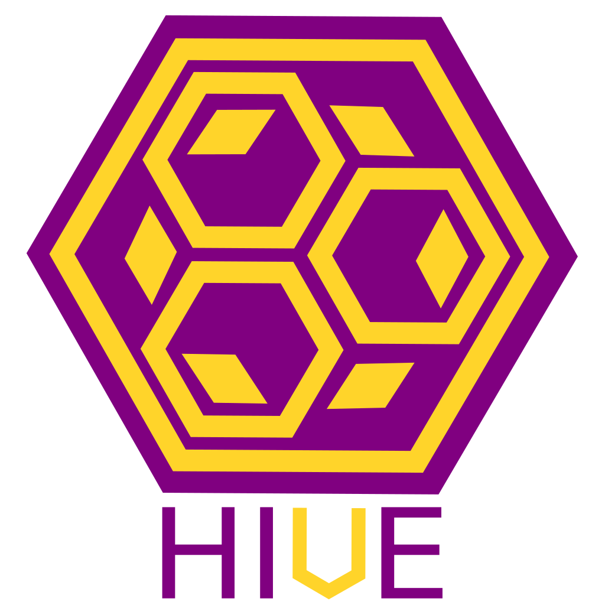

<h1 align=center>
    
</h1>

Steps to completion ->
    
Get sprites working->
    Need to be able load sprite data from file or from buffer. 
    Get it presented on screen
    Be able to adjust it's position

    Get a texture drawing system working->
        Use web technologies for this interface.

Get Basic Game Object working->
    Use drone props to determine what order something should be drawn to screen
    Use props for basic physics interaction.

Get Text system working->
    Use some library to load text textures.
    Create basic string implementation -> May use string packs. 

Get standalone system working->

Create Basic levels
    Item interaction    
    Exit / Entry


Threading Options
    Each nood should have it's own counter
        

Mesh: 
    Make attribs, meshes, etc, responsible for uploading data to GPU.

# Current Dev Environment
- Visual Studio Code
    - Plugins:
        | name | version
        |--|--|
        | C/C++ | 0.28.1|
        | C/C++ Clang Command Adapter | 0.2.3|
        | CMake | 0.0.17|
        | CodeLLDB | 1.5.2|
        | Native Debug | 0.25.0|
        | Visual Studio IntelliCode | 1.2.7|
        | WebAssembly | 1.3.1|

- Chrome + Chrome Debug Tools - For WASM

# Dependencies

| name | version
|:--|--|
| Cmake | 3.17.0 | 
| Emscripten / Emsdk |  1.39.9 |
| LLVM and Clang | 9 |
| Python | 3.6 |
| deno | 1.01 |
| CandleFW | 0.1 |

# Python
Python script needs access to the libclang.so or libclang.dll file. Update LD_LIBRARY_PATH to include the path to this library.

# Cmake

Current project command for wasm dev build:
```bash
shell:./build$ emcmake cmake -G Ninja -DCMAKE_BUILD_TYPE=Debug ../
```

Linux build with testing:
```bash
shell:./desktop_build$ cmake -G Ninja -DCMAKE_BUILD_TYPE=Debug ../
shell:./desktop_build$ ninja && ninja test
```